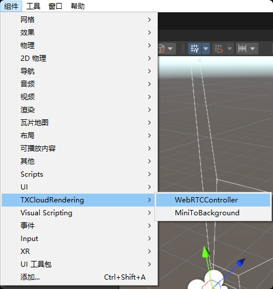
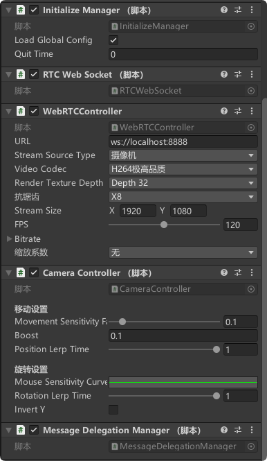
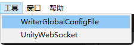
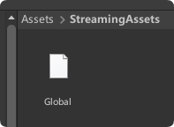
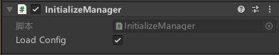
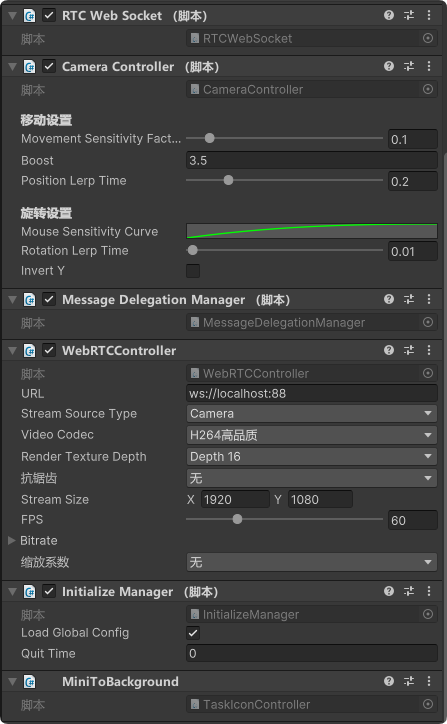

# TXCloudRenderingForUnity
适用于Unity的像素流送插件

## 简介

基于Unity的WebRTC库，inveta的peer-stream库适配的适用于Unity的像素流送插件。

## 功能特性

- 实时流媒体传输
- WebRTC技术支持
- 多种输入设备支持（键盘、鼠标、触摸屏、游戏手柄）
- 可配置的视频编码参数
- ICE服务器穿透支持
- 多平台兼容性

## 安装方式

### 1.安装Packages路径下的前置依赖，在线安装或使用离线包安装
- InputSystem-1.7.0 [InputSystem](https://github.com/Unity-Technologies/InputSystem/releases/tag/1.7.0)

- UnityWebSocket-v2.8.6 [UnityWebSocket](https://github.com/psygames/UnityWebSocket)
- 
- UnityLitJson [UnityLitJson](https://github.com/zhangzhi532200/UnityLitJson)

- com.unity.webrtc-3.0.0-pre.6 [com.unity.webrtc](https://github.com/Unity-Technologies/com.unity.webrtc/releases/tag/3.0.0-pre.6)

2.将Plugins下的dll拷贝至您项目中Plugins路径下

- System.Drawing.dll [2021.X]
- System.Windows.Forms.dll [2021.X]
- TXCloudRendering.Runtime.dll

> System.Drawing、System.Windows.Forms如出现报错，请根据当前使用的Unity版本至安装路径下找到并替换为你使用的版本文件。不要使用Windows自带的！！！**

> 例如使用Unity2021.3.X：
>- System.Drawing.dll [X:\UnityHub\Unity\2021.3.33f1c1\Editor\Data\MonoBleedingEdge\lib\mono\gac\System.Drawing\System.Drawing.dll]
>- System.Windows.Forms.dll [X:\UnityHub\Unity\2021.3.33f1c1\Editor\Data\MonoBleedingEdge\lib\mono\gac\System.Windows.Forms\System.Windows.Forms.dll]

## 组件使用

### 1.TXCloudRendering/WebRTCController 像素流送组件

- 将 WebRTCController 组件添加到场景中的主相机上，该组件负责处理WebRTC连接、视频流传输等功能。

- 添加组件后将会附带包含的依赖脚本：

> InitializeManager脚本 Load Global Config默认为True，将自动读取配置文件，如在编辑器下调试请修改为False，调试完成后需要保存配置请使用WriterGlobalConfigFile进行写入配置。

> InitializeManager脚本 Quit Time默认为0，请在保存配置前填写超时退出时间单位为（秒），否则会出现断线后自动关闭无法重连，调试完成后需要保存配置请使用WriterGlobalConfigFile进行写入配置。

### 2.Tools/WriterGlobalConfigFile 生成基础配置文件

> 如未创建StreamingAssets目录，将会自动创建目录并生成配置文件。

### 3.TXCloudRendering/MiniToBackground 最小化渲染控制器(可选)

将 MiniToBackground 组件添加到场景中的主相机上，该组件可以让应用程序在Windows平台上最小化到后台运行。

### 组件全览

> 请将所有组件统一挂载在主相机(Main Camera)上或创建一个新对象，将所有组件挂载在该对象上。

## 配置说明

系统配置保存在 `StreamingAssets/Global.conf` 文件中，主要配置项包括：

- `ServerUrl`: 信令服务器地址
- `FPS`: 流媒体帧率
- `ExitTime`: 无连接时退出时间
- `streamSourceType`: 流媒体源类型
- `StreamSize`: 流媒体分辨率
- `VideoCodec`: 视频编解码器
- `Bitrate`: 码率设置
- `ICEConfig`: ICE服务器配置

## 待解决遗留问题
- 移动设备多指触控异常
- 支持4k及以上分辨率
- 支持h265视频编码
- Linux最小化后台运行

## 联系作者

QQ：985691579 [>>> 发起会话 <<<](tencent://message/?uin=985691579&Site=&menu=yes)